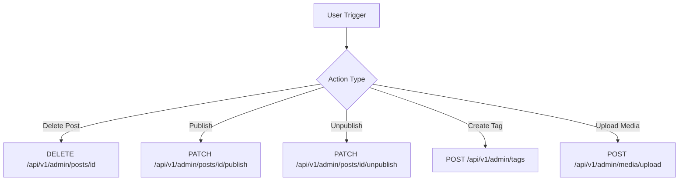
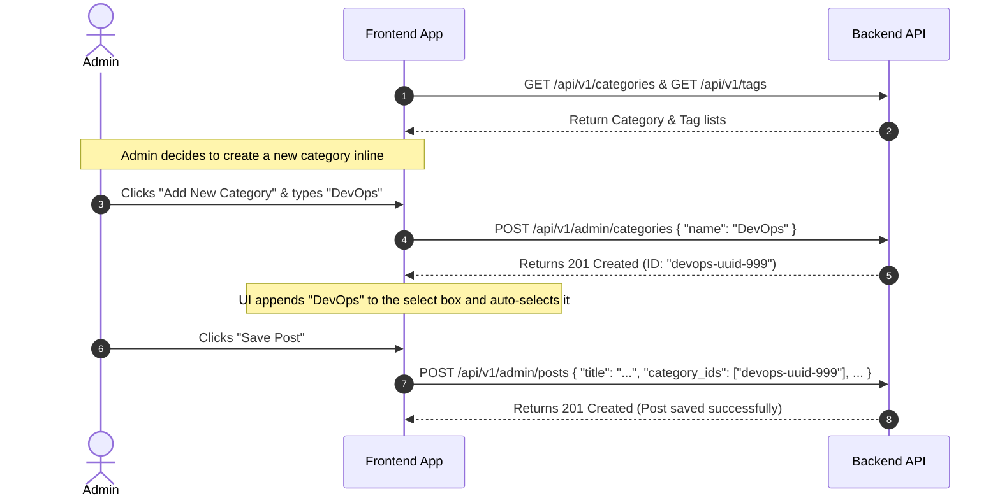

# Admin Panel API Integration Guide

This document outlines the steps, API inventory, data structures, and best practices for integrating the frontend admin panel with the Winzzon Blog backend.

---

## 1. Core Integration Steps & Architecture

To integrate the admin panel APIs successfully, the frontend application should implement the following architectural layers:

### Step 1.1: Authentication & Session Management
1. **Login Flow**:
   - Send credentials to `POST /api/v1/admin/auth/login`.
   - On success, retrieve the `token` and `expires_at`.
   - Store the token securely (e.g., in a secure, HTTP-only Cookie or encrypted `localStorage`).
   - Store `expires_at` in memory to trigger token refresh before expiration.
2. **Token Refresh Flow**:
   - Set up an automatic background timer or middleware that checks token expiration.
   - Before the token expires (e.g., 5–10 minutes prior), invoke `POST /api/v1/admin/auth/refresh` sending the current token in the `Authorization` header.
   - Update the stored token and expiration timestamp with the new values.
3. **Authorization Header**:
   - For all protected routes, attach the token as a Bearer token in the headers:
     ```http
     Authorization: Bearer <your_jwt_token>
     ```

### Step 1.2: Global HTTP Client (Axios / Fetch) Configuration
Configure a global API client instance with interceptors:
- **Request Interceptor**: Automatically append the `Authorization: Bearer <token>` header to admin routes if the token exists.
- **Response Interceptor (401 Unauthorized)**: If any protected request returns a `401 Unauthorized` response, immediately clear the token/session and redirect the user to the `/login` route.
- **Response Interceptor (ValidationError Handling)**: Standardize the handling of validation errors (`422 Unprocessable Entity`) so form fields can display error messages mapping key-to-key with backend validation fields.

### Step 1.3: Category & Tag Caching
- Fetch all categories (`GET /api/v1/categories`) and tags (`GET /api/v1/tags`) when initializing the post editor.
- Cache these lists in global state (e.g., Redux, Pinia, React Context) to avoid redundant requests.
- Invalidate this state when a new category or tag is successfully created, updated, or deleted.

---

## 2. Complete API Inventory for Admin Panel

All admin API endpoints are prefixed with `/api/v1/admin` and require JWT authentication (except the login endpoint).

### 2.1. Authentication APIs

#### 🔑 Login
- **Endpoint**: `POST /api/v1/admin/auth/login`
- **Authentication**: None (Public)
- **Request Body**:
  ```json
  {
    "username": "admin",
    "password": "your_password"
  }
  ```
- **Response (200 OK)**:
  ```json
  {
    "token": "eyJhbGciOi...",
    "expires_at": "2026-05-22T03:05:06Z"
  }
  ```
- **Common Error Codes**:
  - `INVALID_BODY` (400) — Request payload is malformed.
  - `MISSING_FIELDS` (400) — Username or password missing.
  - `INVALID_CREDENTIALS` (401) — Incorrect username or password.

#### 🔄 Refresh Token
- **Endpoint**: `POST /api/v1/admin/auth/refresh`
- **Authentication**: JWT Required
- **Request Body**: None
- **Response (200 OK)**:
  ```json
  {
    "token": "eyJhbGciOi...",
    "expires_at": "2026-05-22T07:05:06Z"
  }
  ```
- **Common Error Codes**:
  - `UNAUTHORIZED` (401) — Missing or expired token.
  - `TOKEN_ERROR` (500) — Internal failure regenerating token.

---

### 2.2. Post Management APIs

#### 📋 List All Posts (Admin View)
- **Endpoint**: `GET /api/v1/admin/posts`
- **Query Params**:
  - `page` (integer, default `1`)
  - `limit` (integer, default `20`, max `100`)
- **Response (200 OK)**:
  ```json
  {
    "data": [
      {
        "id": "787ad74d-0453-4886-8d18-508ea498fe71",
        "title": "Getting Started with Golang",
        "slug": "getting-started-with-golang",
        "body": "<p>Learn Go programming language...</p>",
        "excerpt": "A brief introduction to Go.",
        "reading_time": 3,
        "status": "draft",
        "published_at": null,
        "created_at": "2026-05-21T18:05:06Z",
        "updated_at": "2026-05-21T18:05:06Z"
      }
    ],
    "total": 1,
    "page": 1,
    "limit": 20
  }
  ```
  > [!NOTE]
  > The `List All Posts` response returns categories and tags as empty or null arrays due to performance optimization. Use **Get Post by ID** to retrieve associated categories and tags.

#### 🔍 Get Post by ID
- **Endpoint**: `GET /api/v1/admin/posts/{id}`
- **Response (200 OK)**:
  ```json
  {
    "id": "787ad74d-0453-4886-8d18-508ea498fe71",
    "title": "Getting Started with Golang",
    "slug": "getting-started-with-golang",
    "body": "<p>Learn Go programming language...</p>",
    "excerpt": "A brief introduction to Go.",
    "reading_time": 3,
    "status": "draft",
    "published_at": null,
    "created_at": "2026-05-21T18:05:06Z",
    "updated_at": "2026-05-21T18:05:06Z",
    "categories": [
      {
        "id": "a97c9b0e-b8d9-4f7f-8c3b-5d9c79f972b2",
        "name": "Technology",
        "slug": "technology"
      }
    ],
    "tags": [
      {
        "id": "ccbe5246-24a9-4509-9dbb-cd0b615d8621",
        "name": "Golang",
        "slug": "golang"
      }
    ]
  }
  ```

#### ➕ Create Post
- **Endpoint**: `POST /api/v1/admin/posts`
- **Request Body**:
  ```json
  {
    "title": "Getting Started with Golang",
    "body": "<p>Learn Go programming language...</p>",
    "excerpt": "A brief introduction to Go.",
    "category_ids": ["a97c9b0e-b8d9-4f7f-8c3b-5d9c79f972b2"],
    "tag_ids": ["ccbe5246-24a9-4509-9dbb-cd0b615d8621"]
  }
  ```
- **Response (201 Created)**: (Same structure as Get Post by ID, excluding category/tag details which are synced asynchronously)
- **Common Error Codes**:
  - `VALIDATION_FAILED` (422) — E.g. Title must be 3-255 characters, Body must be >= 10 characters.

#### ✏️ Update Post
- **Endpoint**: `PUT /api/v1/admin/posts/{id}`
- **Request Body**: (Same structure as Create Post)
- **Response (200 OK)**: (Same structure as Create Post)

#### 🚀 Publish Post
- **Endpoint**: `PATCH /api/v1/admin/posts/{id}/publish`
- **Response (200 OK)**: Returns the post object with status updated to `"published"`.

#### ⏸️ Unpublish Post
- **Endpoint**: `PATCH /api/v1/admin/posts/{id}/unpublish`
- **Response (200 OK)**: Returns the post object with status updated to `"draft"`.

#### 🗑️ Delete Post
- **Endpoint**: `DELETE /api/v1/admin/posts/{id}`
- **Response**: `204 NoContent`

---

### 2.3. SEO Metadata APIs

#### 🔍 Get SEO Meta for Post
- **Endpoint**: `GET /api/v1/admin/posts/{id}/seo`
- **Response (200 OK)**:
  ```json
  {
    "id": "e45ba74d-0453-4886-8d18-508ea498f123",
    "post_id": "787ad74d-0453-4886-8d18-508ea498fe71",
    "meta_title": "Getting Started with Golang | Winzzon",
    "meta_description": "Learn Go programming language step by step with this easy guide.",
    "og_title": "Getting Started with Golang",
    "og_description": "Learn Go programming language step by step.",
    "og_image": "https://cdn.winzzon.com/media/golang-banner.webp",
    "canonical_url": "https://winzzon.com/blog/getting-started-with-golang",
    "focus_keyword": "golang",
    "schema_type": "BlogPosting",
    "no_index": false
  }
  ```
- **Common Error Codes**:
  - `SEO_NOT_FOUND` (404) — No SEO record exists for this post yet.

#### 💾 Upsert SEO Meta
- **Endpoint**: `PUT /api/v1/admin/posts/{id}/seo`
- **Request Body**:
  ```json
  {
    "meta_title": "Getting Started with Golang | Winzzon",
    "meta_description": "Learn Go programming language step by step with this easy guide.",
    "og_title": "Getting Started with Golang",
    "og_description": "Learn Go programming language step by step.",
    "og_image": "https://cdn.winzzon.com/media/golang-banner.webp",
    "canonical_url": "https://winzzon.com/blog/getting-started-with-golang",
    "focus_keyword": "golang",
    "schema_type": "BlogPosting",
    "no_index": false
  }
  ```
- **Response (200 OK)**: (Same structure as Get SEO Meta)
- **Common Error Codes**:
  - `VALIDATION_FAILED` (422) — E.g. Meta title must be <= 60 characters, meta description must be <= 160 characters.

---

### 2.4. Media Management APIs

#### 📤 Upload Media File
- **Endpoint**: `POST /api/v1/admin/media/upload`
- **Content-Type**: `multipart/form-data`
- **Form Data Parameters**:
  - `file`: The binary file object (Required)
- **Validation Rules**:
  - File size must be less than **10MB**.
  - Supported mime types: `image/jpeg`, `image/png`, `image/webp`, `image/gif`.
- **Response (201 Created)**:
  ```json
  {
    "id": "bcbe5246-24a9-4509-9dbb-cd0b615d8520",
    "filename": "787ad74d_golang-banner.webp",
    "original_name": "golang-banner.png",
    "url": "https://cdn.winzzon.com/media/787ad74d_golang-banner.webp",
    "mime_type": "image/webp",
    "size_bytes": 142050,
    "width": 1200,
    "height": 630,
    "created_at": "2026-05-21T18:10:00Z"
  }
  ```

#### 📋 List Uploaded Media
- **Endpoint**: `GET /api/v1/admin/media`
- **Query Params**:
  - `page` (integer, default `1`)
  - `limit` (integer, default `20`, max `50`)
- **Response (200 OK)**:
  ```json
  {
    "data": [
      {
        "id": "bcbe5246-24a9-4509-9dbb-cd0b615d8520",
        "filename": "787ad74d_golang-banner.webp",
        "original_name": "golang-banner.png",
        "url": "https://cdn.winzzon.com/media/787ad74d_golang-banner.webp",
        "mime_type": "image/webp",
        "size_bytes": 142050,
        "width": 1200,
        "height": 630,
        "created_at": "2026-05-21T18:10:00Z"
      }
    ],
    "total": 1,
    "page": 1,
    "limit": 20
  }
  ```

#### 🗑️ Delete Media
- **Endpoint**: `DELETE /api/v1/admin/media/{id}`
- **Response**: `204 NoContent`

---

### 2.5. Category Management APIs

#### 📋 List Categories (Public & Shared)
- **Endpoint**: `GET /api/v1/categories`
- **Authentication**: None (Public)
- **Response (200 OK)**:
  ```json
  [
    {
      "id": "a97c9b0e-b8d9-4f7f-8c3b-5d9c79f972b2",
      "name": "Technology",
      "slug": "technology",
      "description": "Tech-related posts"
    }
  ]
  ```

#### ➕ Create Category
- **Endpoint**: `POST /api/v1/admin/categories`
- **Request Body**:
  ```json
  {
    "name": "Technology",
    "description": "Tech-related posts"
  }
  ```
- **Response (201 Created)**:
  ```json
  {
    "id": "a97c9b0e-b8d9-4f7f-8c3b-5d9c79f972b2",
    "name": "Technology",
    "slug": "technology",
    "description": "Tech-related posts",
    "created_at": "2026-05-21T18:00:00Z"
  }
  ```
- **Common Error Codes**:
  - `CATEGORY_EXISTS` (409) — A category with this name already exists.

#### ✏️ Update Category
- **Endpoint**: `PUT /api/v1/admin/categories/{id}`
- **Request Body**: (Same structure as Create Category)
- **Response (200 OK)**: (Same structure as Create Category)

#### 🗑️ Delete Category
- **Endpoint**: `DELETE /api/v1/admin/categories/{id}`
- **Response**: `204 NoContent`

---

### 2.6. Tag Management APIs

#### 📋 List Tags (Public & Shared)
- **Endpoint**: `GET /api/v1/tags`
- **Authentication**: None (Public)
- **Response (200 OK)**:
  ```json
  [
    {
      "id": "ccbe5246-24a9-4509-9dbb-cd0b615d8621",
      "name": "Golang",
      "slug": "golang"
    }
  ]
  ```

#### ➕ Create Tag
- **Endpoint**: `POST /api/v1/admin/tags`
- **Request Body**:
  ```json
  {
    "name": "Golang"
  }
  ```
- **Response (201 Created)**:
  ```json
  {
    "id": "ccbe5246-24a9-4509-9dbb-cd0b615d8621",
    "name": "Golang",
    "slug": "golang",
    "created_at": "2026-05-21T18:00:00Z"
  }
  ```
- **Common Error Codes**:
  - `TAG_EXISTS` (409) — A tag with this name already exists.

#### ✏️ Update Tag
- **Endpoint**: `PUT /api/v1/admin/tags/{id}`
- **Request Body**: (Same structure as Create Tag)
- **Response (200 OK)**: (Same structure as Create Tag)

#### 🗑️ Delete Tag
- **Endpoint**: `DELETE /api/v1/admin/tags/{id}`
- **Response**: `204 NoContent`

---

## 3. Implementation Workflow Patterns: Single-Step vs Multi-Step

For optimal UI performance and cleaner design patterns, distinguish between **Single-Step** integrations and **Multi-Step** frontend workflows.

### 3.1. Single-Step Workflows (Direct Mappings)
These operations execute with a single HTTP transaction. They can be triggered by a single button press or form action.



- **Authentication**: Login (`POST /auth/login`) or Refresh (`POST /auth/refresh`).
- **State Updates**:
  - Delete Post/Media/Category/Tag (Direct `DELETE` requests).
  - Publish or Unpublish Post (Direct `PATCH` requests).
  - Create or Update Category/Tag (Direct `POST`/`PUT` requests).

---

### 3.2. Multi-Step Workflows
These actions require coordinating multiple endpoints sequentially or in parallel.

#### 🏗️ Workflow A: Creating/Updating a Post with Categories & Tags
Before creating or updating a post, the user must have options to select. If options do not exist, they should be created inline.



#### 📝 Workflow B: Creating/Editing a Post with SEO Meta
Creating a post and saving its SEO metadata are separated on the backend database level. The frontend should handle these smoothly:

1. **New Post Creation**:
   - Step 1: User fills out Title, Excerpt, and Body.
   - Step 2: User clicks "Save Draft".
   - Step 3: Frontend sends `POST /api/v1/admin/posts`.
   - Step 4: Backend returns the newly generated Post ID (e.g. `12345`).
   - Step 5: Frontend changes URL route from `/admin/posts/new` to `/admin/posts/12345` (without forcing page reload).
   - Step 6: Frontend immediately enables the "SEO Settings" tab using the new Post ID.
2. **Editing an Existing Post (Double Update Pattern)**:
   - When editing a post, the Admin page typically contains both "Post Content" and "SEO Metadata" fields.
   - When the user clicks "Save Changes":
     - Trigger **Request 1**: `PUT /api/v1/admin/posts/{id}` (updates content).
     - Trigger **Request 2**: `PUT /api/v1/admin/posts/{id}/seo` (updates SEO meta).
     - Execute these concurrently using `Promise.all`:
       ```javascript
       try {
         await Promise.all([
           updatePostContent(postId, contentData),
           upsertPostSEO(postId, seoData)
         ]);
         showToast("Post and SEO updated successfully!");
       } catch (error) {
         // Identify which request failed and display targeted error feedback
         handleDoubleUpdateError(error);
       }
       ```

#### 🖼️ Workflow C: Uploading & Inserting Images in Rich Text Editor
If you are using a Rich Text Editor (e.g. Quill, ProseMirror, TinyMCE):
1. User clicks the "Insert Image" icon or drops a file into the editor.
2. **Step 1**: The frontend intercepts this action, opening a file selector.
3. **Step 2**: The selected file is uploaded to `POST /api/v1/admin/media/upload` (using `multipart/form-data`).
4. **Step 3**: On success, extract the public `url` field from the JSON response.
5. **Step 4**: Inject an `` tag with the corresponding source:
   ```html
   
   ```

---

## 4. Standard Response & Error Formats

### 4.1. Successful Admin API Responses
All successful listings and operations return raw JSON payloads representing the resource or standard paginated structures (no wrapping outer `success` key).

- **Paginated Response Layout**:
  ```json
  {
    "data": [],
    "total": 120,
    "page": 1,
    "limit": 20
  }
  ```

### 4.2. Error Payload Structure
When an API call fails, the backend returns a standardized error structure. The frontend should handle these exceptions globally.

#### Standard Error (e.g. 400, 401, 404, 409, 500)
- **Payload**:
  ```json
  {
    "success": false,
    "error": {
      "code": "ERROR_CODE",
      "message": "Human readable reason for the failure"
    }
  }
  ```

#### Form Validation Error (422 Unprocessable Entity)
- **Payload**:
  ```json
  {
    "success": false,
    "error": {
      "code": "VALIDATION_FAILED",
      "message": "Validation failed",
      "errors": {
        "title": "Title must be between 3 and 255 characters",
        "body": "Body must be at least 10 characters"
      }
    }
  }
  ```
- **Frontend Action**: Map the keys in `error.errors` directly to the input fields on the page to display validation error labels inline under the inputs.
